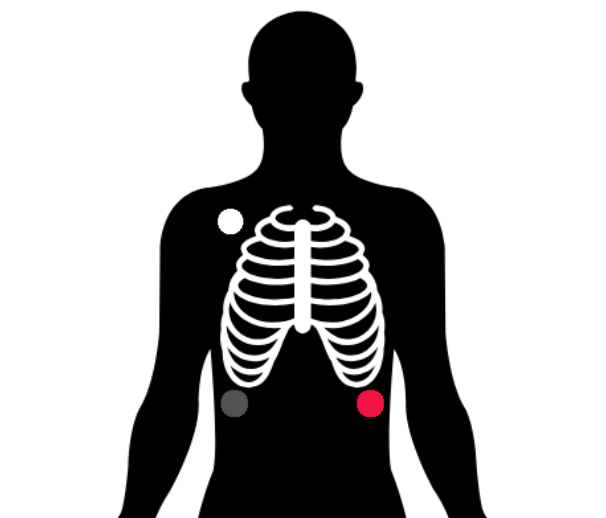
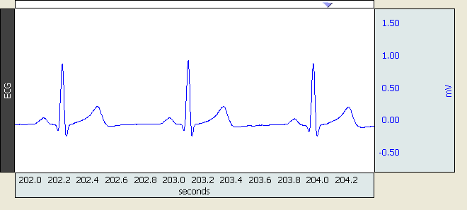

# ECG Recording - Standard Operating Procedure (SOP)

## Before the Participant Arrives

The researcher will gather the following equipment:  
- BIOPAC 3-Lead ECG electrodes (SS2L)  
- BIOPAC disposable self-adhesive electrodes (EL503)  
- Spectra 360 Electrode Gel  
- Water-based wet-wipes  
- 1 disposable razor (optional)  

---

### Open Recording File
If a template recording file for your experiment exists:  
**Open Biopac → Open graph template dromdis... → `template.gtl`**

If this is the first time setting up:  
**Open Biopac → Create empty graph
In the toolbar at the top of the application click MP36 → Set Up Channels...
Ensure the correct recording channel is selected (Electrodermal Activity - EDA) and sampling rate is set to 1000hz
In the top right corner, click Setupand → ensure that the aquisition time is set long enough for your session. If it isnt, Biopac will stop recording before your experiment is complete.

---

## Upon Participant Arrival

### Participant Briefing and Consent
- Welcome the participant and explain the procedure.  
- Allow the participant to read the information sheet and ask any questions before signing the consent form.

---

### Hair Trimming
Show the participant the diagram outlining electrode placement sites (Fig. 1).  
If the participant has excess hair on the placement sites, ask them to clip a **2–3 inch radius** around the site using a disposable razor (this is very rarely necessary).

---

### EEG Electrode and Wire Configuration

#### Skin Preparation
- Provide the participant with an alcohol wipe and gauze pad.  
- Ask them to clean each electrode site — first with the alcohol wipe, then with the gauze.  
- Allow the skin to dry fully.

#### Electrode Inspection
- Peel the backing off of the BIOPAC EL503 electrode patch and inspect the electrode.  
- If the electrode appears dry, add a small drop of Spectra 360 gel to the patch.

#### Electrode Placement
- Ask the participant to place the electrodes according to the diagram provided.

  
   
  <em>Figure 1. Electrode placement diagram for ECG.</em>

---

### Attaching ECG Leads

Demonstrate the attachment process to the participant:  
Show how to connect the ECG wire by pressing the side tabs and pushing the clip onto the metal surface of the electrode until it clicks securely into the divots.  
Ensure the **metal side of the clip faces down** against the electrode.

#### White Lead
- Hand the participant the **white wire** and instruct them to feed it underneath their top and attach it to the electrode on their **shoulder** (Fig. 1).  
- Ask the participant to form a small **loop in the ECG wire on their chest** and secure it with **medical tape**. This helps prevent tension on the lead and reduces the risk of the wire pulling on the electrode during the recording (Fig. X).  
- Offer assistance if needed, as this electrode can be difficult for them to see. **Ask for permission** before providing physical assistance.

#### Black Lead
- Give the participant the **black wire** and instruct them to connect it to the electrode **below the shoulder**.  
- Repeat the wire loop and medical tape procedure (Fig. 1).

#### Red Lead
- Provide the participant the **red wire** and instruct them to attach it to the electrode on the **opposite side of the lower abdomen or stomach area**.  
- Repeat the wire loop and medical tape procedure (Fig. 1).
- Ask the participant to clip the electrode wires to their **trouser waistband** using the crocodile clip.

---

## Starting the Recording and Initial Signal Check

### Start Recording
- Press **‘Start Recording’** on the Biopac system.  
- Verify that the live signal appears as expected (see Fig. 2).

  
   
  <em>Figure 2. Example of a clean ECG signal in Biopac.</em>

---

### Troubleshooting Poor Signals
If the recording does not display correctly, check the following:  
- Ensure all electrode leads are in the **correct position**.  
- Confirm that each electrode is **fully pushed into place** (see Fig. X).  

If the signal is still incorrect, try:  
- Attaching **new electrodes**.  
- Adjusting the **amount of gel** (adding or removing as needed).

---

## Post-Recording Procedure and Data Processing

### Stop the Recording
- Press **“Stop”** on the Biopac system (see Fig. X).

---

### Remove Electrodes
- Instruct the participant to **unclip the lead wires**.  
- Place each electrode lead on the **correctly labelled hook** for storage.  
- Ask the participant to **remove the self-adhesive electrode patches**.  
- Provide a **water-based wet wipe** so the participant can remove any residual gel or adhesive.

**Disposal**  
- Dispose of gauze pads, wet wipes, and electrode patches in the **general waste bin**.  
- **Razors** should be wrapped in paper and taped securely before being placed in the general waste bin.

---

### Filter and Save Data
1. Save the unprocessed file using a clear, descriptive filename (e.g., `sub_001_raw`)..  
2. Apply filters by navigating to:  
   **Transform → IIR → Low + High Bandpass**  
   - Set **Low cutoff:** 0.5 Hz  
   - Set **High cutoff:** 40 Hz  
3. Save the processed file using a clear, descriptive filename (e.g., `sub_001_filtered`).

---
