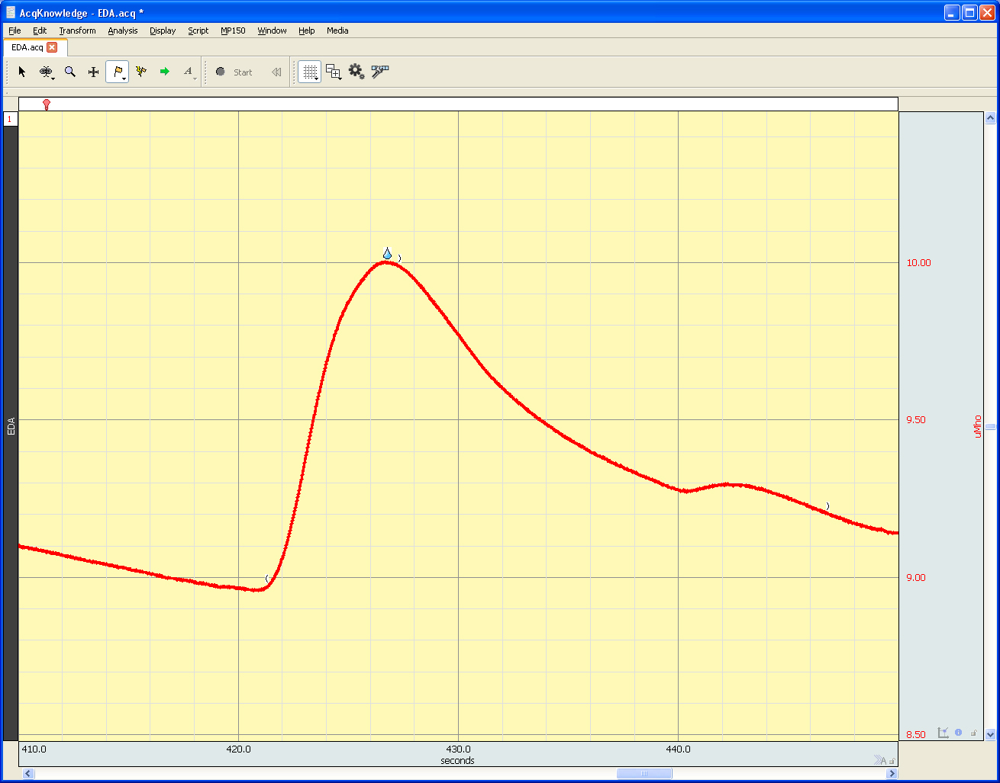

# **Standard Operating Procedure (SOP): Electrodermal Activity (EDA) Recording**

## **Before the Participant Arrives**

The researcher will gather the following equipment:

- BIOPAC 2-Lead EDA set (SS57L)
- BIOPAC disposable EDA electrodes (EL509)
- BIOPAC isotonic electrode gel (GEL101A)
- Water-based wet wipes

## Open Recording File
If a template recording file for your experiment exists:  
**Open Biopac → Open graph template dromdis... → `template.gtl`**

If this is the first time setting up:  
**Open Biopac → Create empty graph
In the toolbar at the top of the application click MP36 → Set Up Channels...
Ensure the correct recording channel is selected (Electrocardiogram -EEG) and sampling rate is set to 1000hz
In the top right corner, click Setupand → ensure that the aquisition time is set long enough for your session. If it isnt, Biopac will stop recording before your experiment is complete.

---

## **Upon Participant Arrival**

### **Participant Briefing and Consent**

- Welcome the participant and explain the procedure.  
- Allow the participant to read the information sheet and ask any questions before signing the consent form.

### **Electrode Inspection**

- Peel the backing off the BIOPAC EL503 electrode patch and inspect the electrode.  
- If the electrode appears dry, add a very small drop of Spectra 360 gel to the patch.

> **Helpful Hints**  
> 

> 
Click to expand

> - Only add a very small amount of gel to the electrode (if needed). Excessive gel will cause poor signal.
> 

### **Electrode Placement**

- Ask the participant to face the palm of their left hand toward the ceiling.  
- Place the electrodes on the index and middle fingers of the participant’s hand (Fig. 1).  
- Secure the **BIOPAC SS57L lead wires** to the electrodes.  

### **Attaching EDA Leads**

- Connect the EDA lead by pressing the side tabs and pushing the clip onto the metal surface of the electrode until it clicks securely into the divots.  
- Ensure the **metal side of the clip faces down** against the electrode.  
- Ensure the **red lead** is placed on the index finger and the **black lead** on the middle finger (Fig. 1).

  
   
  <em>Figure 1. Correct placement of EDA electrodes on the non-dominant hand.</em>

---

## **Starting the Recording and Initial Signal Check**

### **Start Recording**

- Press **“Start Recording”** on the Biopac system.  
- Verify that the live signal appears as expected (see Fig. X).

  
   
  <em>Figure X. Example of a clean ECG signal in Biopac.</em>

---

## **Signal Inspection and Troubleshooting**

When inspecting the signal, you may encounter a few common issues.  
The sections below describe what these problems look like and how to fix them — starting from the simplest solutions and moving toward more involved adjustments.

### **1. The signal looks “analogue” or unstable**

  
   
  <em>Figure X. Example of a clean ECG signal in Biopac.</em>

**Possible causes:**  
- Loose or partially connected leads  
- Poor electrode contact  

---

### **2. The signal appears “stepped” or has flat segments**

This can look like the trace is jumping between fixed levels instead of forming a smooth curve.

  
   
  <em>Figure X. Example of a clean ECG signal in Biopac.</em>

**Possible causes:**  
- The display is zoomed in too far (scaling issue)  
- Loose leads or insufficient gel  
- Electrodes have dried out  

**Try the following (in order):**  
1. Check that this is not a **display scaling issue** — click **“See all data”** to view the full signal.  
2. **Detach and reattach** the leads to ensure a good connection.  
3. **Attach new electrodes** and adjust the amount of gel applied. Ensure the participant **wipes off any old gel** before reapplying.

> **Helpful Tips**  
> 

> 
Click to expand

> - If the participant’s hands are cold — for example, during winter or after using the bathroom and washing with cold water — the signal quality may be affected. Ask the participant to warm their hands by rubbing them together or running them under lukewarm water, then dry them thoroughly before reattempting electrode setup. 
> 

---

### **3. Testing for Responsiveness**

When you see a smooth signal, you can do a final check for signal responsiveness.

- Ask the participant to take **two sharp inhales through the nostrils.**  
- A proper connection should show a clear **skin conductance response** in the trace (Fig. X).  

**If no change is visible**, run through the steps outlined above until you are able to see a clear skin conductance response.

  
   
  <em>Figure X. Skin Conductance Response to sniff test.</em>

> **Helpful Tips**  
> 

> 
Click to expand

> - To determine whether the signal is showing a good response, scale the data channel appropriately. If you leave BIOPAC to collect data for 10+ seconds and then right-click “See all data,” you will get a better sense of the overall pattern.
> 

---

### **4. Securing the Electrodes**

Once you have confirmed that the signal quality is good, secure the electrodes in place using **medical tape**.  
When applying the tape, check with the participant that it is not too tight — the tape should be secure but should **not restrict blood flow or cause discomfort**.

  
   
  <em>Figure X. Securing electrodes in place.</em>

---

## **Post-Recording Procedure and Data Processing**

### **1. Stop the Recording**

- Press **“Stop”** on the Biopac system (see Fig. X).

---

### **2. Remove Electrodes**

- Ask the participant to unclip the lead wires from the electrodes.  
- Ask the participant to gently remove the self-adhesive electrode patches.  
- Provide **water-based wet wipes** so the participant can remove any residual gel or adhesive.  

---

### **3. Filter and Save Data**

1. Save the unprocessed file using a clear, descriptive filename (e.g., `sub_001_raw`).  
2. Apply filters by navigating to:  
   **Transform → IIR → Low Bandpass**  
   - Set **Low cutoff:** 10 Hz  
3. Save the processed file using a clear, descriptive filename (e.g., `sub_001_filtered`).

---

### **4. Post-Measurement Cleanup**

- Dispose of all used materials appropriately:  
  - Wet wipes and electrode patches → **general waste bin**.
