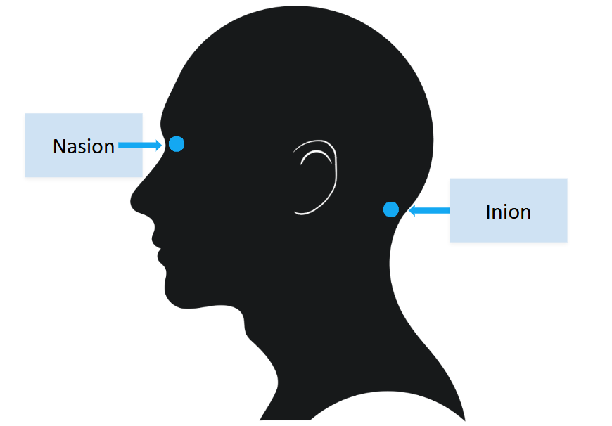

# EEG Manual - Standard Operating Procedure (SOP)
**Authors:** Carmen McClean-Daoust & Ellie Ambridge

---

## Equipment list
- Flexible tape measure.
- Skin friendly sticky tape.
- Paper towel/roll/tissue.
- Alcohol wipes.
- Plastic ended syringes.
- Electrode gel (signagel for BioSemi systems).
- Flat electrode stickers for EXGs.
- Dry electrode caps.
- Clean & dry electrode bundles (e.g. A: 1-32, B: 33-64, C: 65-97, D: 98-128, EXG1-8).

---

## Essential Steps (Brief Overview)

1. Gather all materials in equipment list and prepare for session by filling syringe with gel and putting stickers on flat EXG electrodes.  
2. Measure the widest part of the participant’s head and select electrode cap based on size - for signal quality it is very important to have a snug fit, so always choose the smallest possible size whilst maintaining participant comfort.
   

| **Cap size**     | **Cap colour**  | **Cap measurement** |
|:-----------------|:----------------|:--------------------|
| Small            | 🟨 Yellow        | 50 – 54 cm            |
| Small/Medium     | 🟥🟨 Red/Yellow  | 52 – 56 cm            |
| Medium           | 🟥 Red           | 54 – 58 cm            |
| Medium/Large     | 🟥🟦 Red/Blue    | 56 – 60 cm            |
| Extra large      | 🟦 Blue          | 58 – 62 cm            |

3. If rereferencing to the mastoids: Clean mastoids with alcohol wipe, put gel in flat electrode well, remove backing of electrode sticker and place electrodes on mastoids. Secure further with a strip of tape.  
4. Fit EEG cap to participant's head, ensuring central electrode (A1 for ABC system, CZ for 10-20 system), is halfway between the front and back of the head (nasion to inion), as well as from side-to-side. Make sure the cap is **FIRMLY** against the head.
7. Insert syringe into each electrode holder and insert gel systematically to around 3/4 full.  
8. Connect electrode bundles and any external EXG electrodes to AD box and turn on.  
9. Start signal quality check by selecting offsets tab on actiview. Ensure all channels are <+/-50µV, and not fluctuating. If high or unstable offsets, remove electrode, insert addition gel, check for wire tension, reinsert electrode and recheck offset.
10. Next, check signal waveforms. For any noisy channels follow the above steps (channels can be noisy in offsets and not waveform, or vice-versa. Do electrode adjustments for each, separately).
11. Conduct experiment, remove equipment in reverse order to setup, and handwash EEG equipment immediately following the session (electrodes - warm water only; cap - warm water and gentle detergent).
---

## Quick Guide: How to Get Clean Signals

CAPS: 
They need to fit tightly!!! Both in size but also in placement. Once the position of the cap has been established, grab either size of the cap (near the ears), and pull down firmly. Tell the participant that you are going to do this and make sure that you don't pull on any hairs in the process. 

INSERTING GEL: 
Move hair side-to-side with syringe, then ever so slightly lift away from the scalp before inserting gel in a smooth gradual process whilst pulling the syringe out of the electrode holder.  

EXTERNAL ELECTRODES: 
Use extra tape for securing any/all EXG flat electrodes.

CHECKING CHANNEL QUALITY: 
Before starting the experiment, ensure all channels are clean and stable. Firstly, check the offsets tab, aiming for around <+/-50µV, (not 10µV, this value is often incorrectly referenced and stems from EEG systems using impedance. This is not equivalent to offsets, which, according to the manufacturers, can produce clean recordings up to +/-100µV). 

WIRE PLACEMENT: Try and put as little strain and stretch on the electrodes as possible. This includes, taping EXG electrode wires to participant's shoulders, taping electrode bundles to a desk or chair, and orentating electrode wires to 'flow' towards the AD box.

GLOBAL NOISE:
If all channels look strange, the first thing to check is the CMS/DRL electrodes! These are critical for the entire recording.
    
---

# Extended Instructions

## 1. Before the Participant Arrives

### Participant Preparation
- It is best to ensure that the participant comes to the experiment without makeup, hair gel, mousse, or hair product in their hair.

### Prepare the Gel Syringes
1. Fill syringes with gel (Fig x.).  

  

    
     
    <em>Figure X. Filled Syringes.</em>
  

  
> **Helpful Tips**  
> 

> 
Click to expand

>   
> - Syringes should only ever be plastic tipped! BioSemi active electrodes do not require scalp abrasion.  
> - To prevent air bubbles from entering the syringe, tap the gel bottle on a hard surface to make it settle. 
> - To fill the syringes, remove the plunger and put the end of the gel bottle inside the back of the syringe.
> - Do not fill syringes completely to the top; otherwise, the gel will overflow when you insert the plunger.  
> - Make sure to clean gel off the tip of the tube before and after filling the syringes.  
> 

### Check Equipment
- Make sure all electrodes are ordered and untangled.  
- Make sure measuring tape and adhesive tape are within reach.  
- Make sure the head cap you need is dry (if damp from previous session, you can gently dry the caps with a hairdryer).  

### Prepare Electrodes
- Prepopulate the electrodes with adhesive rings.  
- Make sure that the hole of the sticker aligns with the metal part of the electrode.  

  

    
     
    <em>Figure X. Adhesive rings attached to electrodes.</em>
  

---

## 2. Upon Participant Arrival

### Participant Briefing and Consent
- Explain the procedure to the participant.  
- Give the participant plenty of time to read the information sheet and sign the consent form.  
- Ask participants to remove hairbands, bobby pins, glasses, and any other facial or ear jewellery before beginning the experiment. Glasses can be put on again after capping. 

---

## Cap Fitting and Electrode Setup

#### Determine Cap Size
- Measure the participant’s head:  
  - **Circumference:** Place the tape just above the ears. 
  - **Length:** Beginning at the nasion and ending at the inion.

    
     
    <em>Figure X. Measuring head circumference and length.</em>
  

      
- The sizes can be found on the label in the back of the cap.  
> **Helpful Tips**  
> 

> 
Click to expand

> 
> - Always choose the smallest cap you can based on their head size. (For example, if the participant’s head circumference is x cm → use head cap x–x cm).  
> 

#### Prepare Mastoid Electrode Sites
- Wipe behind the participant’s ears with an alcohol wipe.  
- Dry off with a paper towel.
  
> **Helpful Tips**  
> 

> 
Click to expand

> 
> - If your participant is wearing makeup, take extra care to ensure it is completely removed from the mastoid electrode placement site before proceeding. This is an important reference point for the EEG setup, so you want to make sure the electrode stays securely in place 
> 

#### Place Mastoid Electrodes
- Place electrode on mastoid site by lining it up with the preauricular point and mastoid process.

    
     
    <em>Figure X. Mastoid Electrode Placement.</em>
  

**Helpful Tips**  
> 

> 
Click to expand

> 
> - Begin the gelling process systematically (e.g., in strips or rows).  
>
> - Make sure you get close in behind the ear.  
> - Secure the electrode with extra tape.  
> - Make sure you don't stick participant’s hair down.  
> 

#### Fit the EEG Cap
- Ask the participant to look up toward the ceiling and place the cap on their head.  
- Hold the ear flaps and pull cap down, wiggling slightly side to side.  
- Make sure you pull the cap down to get it sitting firmly against the head.  
- Ask the participant to do up the chin strap. while you hold the mastoids still.  
- Ask the participant to poke their ears through the cap ear holes (if using mastoid electrodes, it is good to hold these still so they don't get dislodged).

#### Center and Align the Cap
- Make sure the cap is properly centered. 
- Use a measuring tape to ensure that the Cz (Vertex) is in the center of the head:  
  - Halfway between the nasion and inion  
  - Halfway between the ears

  

    
     
    <em>Figure x. Centreing the EEG Cap.</em>
  

  
---

### Begin Gelling Electrodes
1. Carefully push the plastic syringe end through the electrode aperture until it reaches the participant’s scalp.  
2. Gently move some hair to the side by pushing the tip of the needle side to side.  
3. Lift the syringe slightly (otherwise the syringe end will be covered by the skin and no gel can come out).  
4. Use the nozzle to apply a small amount of gel.  
5. Spread the gel with a circular motion of the needle on the scalp, but do not overdo it. Too much gel can create “bridges” between electrodes.  
6. Slowly retract the needle, injecting enough gel to fill any air pockets left by the needle.

**Helpful Tips**  
> 

> 
Click to expand

> 
> - Carry out the gelling process systematically (e.g., in strips or rows) to avoid forgetting which ones you’ve already done.  
> - Place syringe between middle and index finger and use your palm to press down on the plunger.   
> - Be especially careful around CMS/DRL electrodes as these are crucial for proper data collection.   
> 

---

### Attach Electrodes
- The electrodes are numbered. Insert them in ascending order to avoid tangling.  
- Click electrodes into aperture; if resistance is felt, add more gel.  

**Helpful Tips**  
> 

> 
Click to expand

> 
> - Handle electrodes with care; they are delicate.  
> - Drape electrode wires over your shoulder to avoid dragging on the floor.  
> - Ensure electrodes aren’t clicked in at an angle. 
> - Make sure tails point in the direction you want wires to lie. 
> - Each electrode has a tail; orient it so the wires run neatly down the back of the participant’s neck.  
> - Leave the C-line electrodes until last as they’re most awkward to set up.
> - For transport: ask the participant to hold remaining leads in one hand to prevent trailing while walking.
> 

---

### Connect Electrode Bundles to AD Box
- Face leads away from participant.  
- Tape bundles to the table to prevent movement.  

  

    
     
    <em>Figure X. Connect Bundles to AD box.</em>
  

---

## 3. Computer Setup
1. Open ActiView software.  
2. Navigate to **About ActiView → Set Up Configuration File → Start → Start File**.  
3. Browse to your folder and choose a filename (e.g., MyStudy_SubXXX).  
4. Confirm folder path.  
5. Check battery status of AD box.

 

    
     
    <em>Figure X. Where to check AD box battery.</em>
  

---

## 4. Data Quality Checks
- If using a reference, start by selecting this. The numbering is as following, 1-128 are the 32x4 electrode bundles, then 129-136 are the 8 EXG electrodes. In our lab, we used EXG1-4 for ECOG, and EXH5-6 for mastoids, so when collecting data we select reference 133+134 (hold control to select multiple channels).

 

 

- Switch to **Electrode Offset** tab.  
- SClick Reference → Free Choice. 
- Look for electrode offset to be between -50 µV and +50 µV.  
- Stable, non-flickering electrodes are essential.
- Any unused electrodes (e.g. not plugged in), will show maximum offset by default.

 

 

**Helpful Tips**  
> 

> 
Click to expand

> 
> - Reclick, add/remove gel, move hair, or wiggle electrode if offsets are too high.  
> 

- Left: Example of poor signal and offsets, Right: Example of good signal and offsets..

  

    
     
    <em>Figure X. Examples of Good Signal Quality.</em>
  

---

## 5. Starting and Ending the Recording
1. Press **Pause** to start recording. “Saving” turns green.  
2. At experiment end, click **Pause → Stop**.  
3. Turn off AD box.

**Helpful Tips**  
> 

> 
Click to expand

> - Adding a trigger code to your script start the recording and stop recording ensures all data is accurately recorded (and not accidentally missed).
> 

---

## 6. Post-Experiment

### Disconnect Electrode Bundles
- Push tabs and lift by base.  

**Helpful Tips**  
> 

> 
Click to expand

> 
> - Avoid lifting by wires to prevent damage.  
> 

### Remove Cap and Electrodes
- Unclip chinstrap.  
- Remove electrodes by housing, not wire; pinch to unclip.  

**Helpful Tips**  
> 

> 
Click to expand

> 
> - Twist electrodes gently into position so you can use the plastic base as leverage  .  
> - Drape bundles over shoulder to prevent dragging.  
> - Hang each bundle neatly after unclipping to prevent them from getting tangled.  
> 

### Participant Clean-Up
- Show participant to shower/sink.  
- Provide towel and shampoo if required.

---

## 7. Cleaning Equipment

### Protect the AD Connectors from Water Damage
- Prior to any cleaning, and immediately after removing the electrodes from the participant’s cap, it is extremely important to cover the bundle connectors with a waterproof barrier e.g. zip-locked bag. This is to avoid any moisture from entering and damaging the connections.

 

  
  

### Cleaning the Electrodes
- Electrodes must be cleaned with **warm water only**.
- Use a plastic bowl/bucket to place the electrodes in - the electrode tips must never come into contact with metal as this causes pollution of the Ag/AgCI (silver/silver chloride) pellets, increasing signal noise and premature wear.

 

  

- The gel should mostly dissolve with the warm water, but it is neccesaary to use your fingers to clean any remaining gel on the electrode ends.  
- Very carefully dap dry the electrodes with a towel of paper towel.
- Hang to dry - Making sure electrode connectors are above the electrode ends to avoid any water ingress to connectors.
- Electrode ends must not come into contact with metal at any point.

 

  

**Helpful Tips**  
> 

> 
Click to expand

> 
> - You can drill small holes in a plastic bucket so you can have continually fresh water flowing as you clean the electrodes.
> - You should place the electrode connector as far away from the water as possible to avoid accidental damage (e.g. put in higher shelf/cupboard).
> - When moving with the electrodes, you can drape the bundles over your shoulders (like an electrode necklace) to prevent dragging or damage.  
>   
> 

### Cleaning the Caps
- Caps should be **hand washed only**, using warm water and a mild detergent.
- Caps do not have to avoid metal.
- Put some detergent and warm water on the cap and hand wash, mainly focussing on the webbed material.
- Use a small brush (pipe cleaning brushes work well), to clean within each individual electrode holder.
- Work systematically, e.g. by colour or number, to ensure you don't miss any.
- To check if all the gel has been removed from the openings, look at whether there is a glossy reflection still in the hole (this is gel).
- Hang cap to dry (wig stands work well and helps keep the cap shape).
- - It is possible to use a hairdryer on the cap, if needed for the next participant.
  
   

   

  

  

### Syringes
- Put any remaining gel back in the eletrode gel tube (it is quite expensive so minimising waste is a good idea).
- Rinse empty syringes thoroughly with warm water.
- Leave to air dry with the plunger and casing separated.   
  
  
## Technical Sheet

### BioSemi Website
- https://www.biosemi.com/index.htm: The manufactorers website has lots of useful information, particularly their 'forum' section where BioSemi users can ask questions and the manufacturers respond.

### Changing the AD Battery
- When connecting the battery. Notice the hinge mechanism, which should first be attached at the top, and then pressed down so it clicks and is flat. Removing the clips is the opposite. You should unclip the bottom half first, then push the clip upwards slightly (no excessive force should be necessary), in order to release the battery from the AD box.
- If possible, you should always have one battery plugged in, on charge, there is no risk of overcharging if left connected.
   

   
 
  

  

### CM Blue Light Blinking
- On the front of the AD box, if the Blue LED is blinking, then all power to the AD-box is shut down and the active electrodes will not be able to measure anything.
- This could be caused by: kinked wires, gel inside connectors, or no CMS/DRL connection.

 

  

### The Bucket Test - Checking for Faulty Electrodes
- Fill a glass or plastic bowl or plastic bucket (no metal) with tap water and add a teaspoon of table salt (NaCl).
- Connect a CMS/DRL cord to the front of the AD-box, or connect a P32 electrode set with integrated CMS/DRL to the "A" SCSI connector on the top of the AD-box.
- Now first submerge only the CMS and DRL electrodes into the water. The Blue LED should now turn on. If the Blue LED turns off (blinking) then most likely the CMS/DRL electrodes are defect.
- Now submerge the offending electrode(s) into the water, one by one and observe the Blue LED.
- If there are any kinked wires, then moving/bending the electrodes and wires, will reveal them quicker.
- If the Blue LED turns off, then you have found the problematic electrode(s).

### ActiRead
- Downloadedable from the BioSemi website (https://www.biosemi.com/download.htm).
- ActiRead is a dedicated file reader that can be used on personal computer to check your recorded .bdf files.
- The user interface is setup in a similar fasion to the ActiView programme used during data aquisition (you can only view 16 channels at a time in ActiRead).
- This is particularly useful as a first step of data cleaning.
 

  

---
