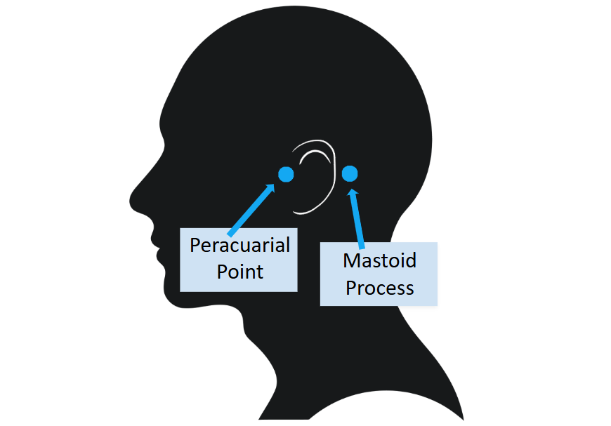

# EEG Manual - Standard Operating Procedure (SOP)
**Authors:** Carmen McClean-Daoust & Ellie Ambridge

---

## Essential Steps (Brief Overview)

1. Prepare gel syringes and ensure all equipment is ready.  
2. Measure participant’s head and select appropriate EEG cap.  
3. Place mastoid electrodes and secure with tape.  
4. Fit EEG cap snugly and center Cz electrode.  
5. Insert and gel scalp electrodes systematically.  
6. Connect electrode bundles to AD box and start recording.  
7. Monitor electrode offsets and adjust as needed.  
8. End recording, remove electrodes/cap, and clean participant.  
9. Clean equipment, electrodes, and cap thoroughly.  

---

## Quick Guide: How to Get Clean Signals

- Ensure CMS/DRL reference electrodes are correctly placed and have good contact.  
- Apply sufficient gel under each electrode, avoiding air pockets.  
- Gently wiggle electrodes and move hair to ensure proper contact.  
- Check offsets in ActiView; critical electrodes first if time is limited.  
- Minor deviations in non-essential electrodes are usually acceptable.  
- Avoid over-gelling, which can create “bridges” between electrodes.  

---

# Extended Instructions

## 1. Before the Participant Arrives

### 1.1 Participant Preparation
- It is best to ensure that the participant comes to the experiment without makeup, hair gel, mousse, or hair product in their hair.

### 1.2 Prepare the Gel Syringes
1. Fill syringes with gel.  
     
> **Helpful Tips**  
> 

> 
Click to expand

>   
> - Whenever possible, use 412 syringes.  
> -  To prevent air bubbles from entering the syringe, make sure the electrode gel has settled completely at the bottom of its tube before transferring it. If you notice air pockets in the gel tube, tap it firmly on a hard surface or shake it to release the trapped air before filling the syringe.
> - Do not fill syringes completely to the top; otherwise, the gel will overflow when you insert the plunger.  
> - Make sure to clean gel off the tip of the tube before and after filling the syringes to prevent them from getting blocked.  
> 

### 1.3 Check Equipment
- Make sure all electrodes are ordered and untangled.  
- Make sure measuring tape and adhesive tape are within reach.  
- Make sure the head cap you need is dry.  
- You can speed-dry it with the hair dryer, but **only use cold air** so as not to damage the cap.

### 1.4 Prepare Electrodes
- Prepopulate the electrodes with adhesive rings.  
- Make sure that the hole of the sticker aligns with the metal part of the electrode.  
  

---

## 2. Upon Participant Arrival

### 2.1 Participant Briefing and Consent
- Explain the procedure to the participant.  
- Give the participant plenty of time to read the information sheet and sign the consent form.  
- Ask participants to remove hairbands, bobby pins, glasses, and any other facial or ear jewellery before beginning the experiment. Glasses can be put on again after capping. 

---

### 2.2 Cap Fitting and Electrode Setup

#### 2.2.1 Determine Cap Size
- Measure the participant’s head:  
  - **Circumference:** Place the tape just above the ears. 
  - **Length:** Beginning at the nasion and ending at the inion.

    
     
    <em>Figure X. Measuring head circumference and length.</em>
  

      
- The sizes can be found on the label in the back of the cap.  
> **Helpful Tips**  
> 

> 
Click to expand

> 
> - Always choose the smallest cap you can based on their head size. (For example, if the participant’s head circumference is x cm → use head cap x–x cm).  
> 

#### 2.2.2 Prepare Mastoid Electrode Sites
- Wipe behind the participant’s ears with an alcohol wipe.  
- Dry off with a paper towel.
> **Helpful Tips**  
> 

> 
Click to expand

> 
> - If your participant is wearing makeup, take extra care to ensure it is completely removed from the mastoid electrode placement site before proceeding. This is an important reference point for the EEG setup, so you want to make sure the electrode stays securely in place 
> 

#### 2.2.3 Place Mastoid Electrodes
- Place electrode on mastoid site by lining it up with the preauricular point and mastoid process.

    
     
    <em>Figure X. Mastoid Electrode Placement.</em>
  

**Helpful Tips**  
> 

> 
Click to expand

> 
> - Begin the gelling process systematically (e.g., in strips or rows).  
>
> - Make sure you get close in behind the ear.  
> - Secure the electrode with extra tape.  
> - Make sure you don't stick participant’s hair down.  
> 

#### 2.2.4 Fit the EEG Cap
- Ask the participant to look up toward the ceiling and place the cap on their head.  
- Hold the ear flaps and pull cap down, wiggling slightly side to side.  
- Make sure you pull the cap down to really get it tight.  
- Ask the participant to do up the chin strap while you hold the mastoids still.  
- Then get the participant to pull their ears through.

#### 2.2.5 Center and Align the Cap
- Make sure the cap is properly centered.   
- Use a measuring tape to ensure that the Cz (Vertex) is in the center of the head:  
  - Halfway between the nasion and inion  
  - Halfway between the ears

---

### 2.3 Begin Gelling Electrodes
1. Carefully push the blunt needle through the electrode aperture until it reaches the participant’s scalp.  
2. Gently move some hair to the side by pushing the tip of the needle side to side.  
3. Lift the syringe slightly (otherwise the blunted needle will be covered by the skin and no gel can come out).  
4. Use the nozzle to apply a small amount of gel.  
5. Spread the gel with a circular motion of the needle on the scalp, but do not overdo it. Too much gel can create “bridges” between electrodes.  
6. Slowly retract the needle, injecting enough gel to fill any air pockets left by the needle.

**Helpful Tips**  
> 

> 
Click to expand

> 
> - Carry out the gelling process systematically (e.g., in strips or rows) to avoid forgetting which ones you’ve already done.  
> - Place syringe between middle and index finger and use your palm to press down on the plunger.   
> - Be especially careful around CMS/DRL electrodes as these are crucial for proper data collection.   
> 

---

### 2.4 Attach Electrodes
- The electrodes are numbered. Insert them in ascending order to avoid tangling.  
- Click electrodes into aperture; if resistance is felt, add more gel.  

**Helpful Tips**  
> 

> 
Click to expand

> 
> - Handle electrodes with care; they are delicate.  
> - Drape electrode wires over your shoulder to avoid dragging on the floor.  
> - Ensure electrodes aren’t clicked in at an angle. 
> - Make sure tails point in the direction you want wires to lie. 
> - Each electrode has a tail; orient it so the wires run neatly down the back of the participant’s neck.  
> - Leave the C-line electrodes until last as they’re most awkward to set up.
> - For transport: ask the participant to hold remaining leads in one hand to prevent trailing while walking.
> 

---

### 2.5 Connect Electrode Bundles to AD Box
- Face leads away from participant.  
- Tape bundles to the table to prevent movement.  
  

---

## 3. Computer Setup
1. Open ActiView software.  
2. Navigate to **About ActiView → Set Up Configuration File → Start → Start File**.  
3. Browse to your folder and choose a filename (e.g., MyStudy_SubXXX).  
4. Confirm folder path.  
5. Check battery status of AD box. 

---

## 4. Data Quality Checks
- Switch to **Electrode Offset** tab.  
- Set Displayed Range Scale to 50 µV.  
- Click Reference → Free Choice → select electrodes for closer inspection  .  
- Ensure electrode offset is between -10 µV and +10 µV.  
- Poor DRL/CMS connections affect all electrodes.  
- Stable, non-flickering electrodes are essential.

**Helpful Tips**  
> 

> 
Click to expand

> 
> - Reclick, add/remove gel, move hair, or wiggle electrode if offsets are off.  
> - If the cap-label is not sticking out, it can distort signals .  
> - Minor deviations in non-critical electrodes are acceptable if youor time is limited.  
> 

- Faulty electrodes far outside [-10 µV, +10 µV] may need replacement. Note non-essential electrodes in session log if needed.

- Final check: ActiView should resemble Figure x. 

---

## 5. Starting and Ending the Recording
1. Press **Pause** to start recording. “Saving” turns green.  
2. At experiment end, click **Pause → Stop**.  
3. Turn off AD box.

---

## 6. Post-Experiment

### 6.1 Disconnect Electrode Bundles
- Push tabs and lift by base.  

**Helpful Tips**  
> 

> 
Click to expand

> 
> - Avoid lifting by wires to prevent damage.  
> 

### 6.2 Remove Cap and Electrodes
- Unclip chinstrap.  
- Remove electrodes by housing, not wire; pinch to unclip.  

**Helpful Tips**  
> 

> 
Click to expand

> 
> - Twist electrodes gently into position so you can use the plastic base as leverage  .  
> - Drape bundles over shoulder to prevent dragging.  
> - Hang each bundle neatly after unclipping to prevent them from getting tangled.  
> 

### 6.3 Participant Clean-Up
- Show participant to shower/sink.  
- Provide towel and shampoo if needed.

---

## 7. Cleaning Equipment

### 7.1 Syringes
- Remove excess gel; rinse thoroughly with warm water.  
- Do not use soap.

### 7.2 Protect AD Connectors from Water Damage
- Cover connectors with sandwich bag; hang in an elevated position above the sink to avoid water entry .

### 7.3 Electrodes
- Rinse in warm water, gently using fingers.  
- Dry with paper towel.

**Helpful Tips**  
> 

> 
Click to expand

> 
> - Work systematically to ensure all electrodes are cleaned (ascending order or by region).  
> 

### 7.4 Cap
- Wash in plastic tub with specialist soap.   

**Helpful Tips**  
> 

> 
Click to expand

> 
> - Use brush to poke through electrode holes.  
> - Track which electrodes you’ve cleaned.  
> 

- Hang cap to dry; if needed for next participant, use cold-air hairdryer only.  

---
